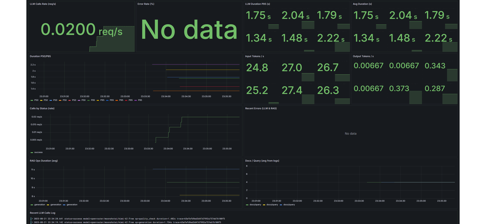
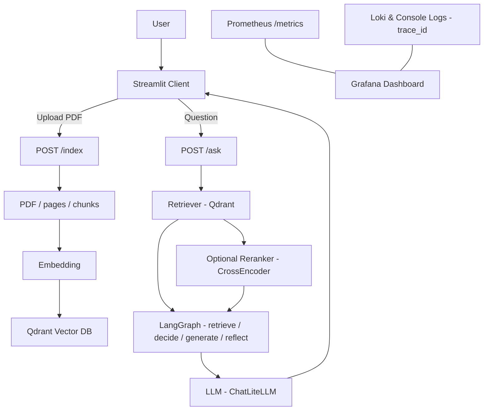

# 🚀 End-to-End PDF RAG System

<p align="center">
  
  <br/>
  <em>🎬 Streamlit Demo</em>
</p>

<p align="center">
  
  <br/>
  <em>📊 Grafana Dashboard & Prometheus Alerts</em>
  
---
<p align="center">
  <a href="https://www.python.org/">
    
  </a>
  <a href="https://fastapi.tiangolo.com/">
    
  </a>
  <a href="https://streamlit.io/">
    
  </a>
  <a href="https://www.docker.com/">
    
  </a>
  <a href="https://qdrant.tech/">
    
  </a>
  <a href="https://grafana.com/">
    
  </a>
  <a href="https://prometheus.io/">
    
  </a>
  <a href="https://langchain.com/">
    
  </a>
  <a href="https://github.com/langchain-ai/langgraph">
    
  </a>
  <a href="https://grafana.com/oss/loki/">
    
  </a>
</p>

## 📊 Project Overview

This project is a modern **Retrieval-Augmented Generation (RAG)** system built to simplify document management and information access. By uploading PDF files, it provides intelligent Q\&A capabilities over those documents. As an example use case, it showcases **information retrieval from HR documents**.

---

## ⚡ Core Components

| Component         | Path                 | Contents                                                                                              |
| ----------------- | -------------------- | ----------------------------------------------------------------------------------------------------- |
| 🌐 **API Layer**  | `src/api.py`         | REST API endpoints, session management, monitoring & metrics collection                               |
| 🧠 **Core Logic** | `src/helper_func.py` | PDF processing & text extraction, RAG workflow orchestration, model management/optimization, caching  |
| 🖥️ **Web UI**    | `src/app.py`         | Streamlit-based UI, document upload & management, Q\&A interaction interface, result visualization     |
| 📝 **Logging**    | `src/loki_logger.py` | Loki integration, Trace ID tracking, structured logging, performance analysis                         |
| 📊 **Monitoring** | —                    | Grafana dashboards, Prometheus metrics, automatic alert rules, real-time monitoring                   |

---

## 🎯 Goals & Features

* **Intelligent RAG Workflow:** retrieval, rerank, reflection, multi-hop support
* **Performance:** caching, GPU support, asynchronous processing, model warmup/preloading
* **Monitoring & Logging:** Prometheus, Grafana, Loki integration
* **Scalability:** containerization

---

## ✨ Tech Stack

### 🏗️ Architecture & Infrastructure

* **Python 3.12+** — modern language features and type hints
* **Docker & Docker Compose** — containerized, reproducible services
* **Grafana & Prometheus** — metrics collection and visualization
* **Loki** — structured log aggregation and querying

### 🌐 Application Layer

* **FastAPI + Uvicorn** — high-performance API layer
* **Streamlit** — interactive web UI

### 💻 Development Environment

* **uv** — fast package/env management and command runner (`uv sync`, `uv run`)

---

## 🚀 Setup & Run

### Requirements

* Python 3.12+
* uv (recommended package/env manager)
* Docker & Docker Compose

```bash
pip install uv # if not installed
```

### Steps

#### 1) Clone the Repository

```bash
git clone https://github.com/mertafacan/End-to-End-PDF-RAG-System.git
cd End-to-End-PDF-RAG-System
```

#### 2) Configure Environment Variables

```bash
cp .env.example .env
```

#### 3) Install Dependencies (uv)

```bash
uv venv
# Activate the environment
source .venv/bin/activate   # Linux/Mac
# Windows: .venv\Scripts\activate

# Install dependencies from pyproject.toml
uv sync
```

#### 4) Start Docker Services

```bash
cd config
docker-compose up -d
```

#### 5) Start the Application

**with uv:**

```bash
uv run uvicorn src.api:app --port 8000 --reload
uv run streamlit run src/app.py
```

### Available Services

* **API:** [http://localhost:8000/docs](http://localhost:8000/docs)
* **Web:** [http://localhost:8501](http://localhost:8501)
* **Grafana:** [http://localhost:3000](http://localhost:3000)
* **Prometheus:** [http://localhost:9090](http://localhost:9090)

---

## 🏗️ Project Architecture

### 🔧 Architecture



### 📁 Directory Structure

```
src/
├── api.py              # FastAPI endpoints
├── app.py              # Streamlit UI
├── helper_func.py      # Business logic
├── loki_logger.py      # Logging system
└── uploaded_docs/      # Uploaded documents

config/
├── alert_rules.yml     # Prometheus alert rules
├── docker-compose.yml  # Docker services (Qdrant, Prometheus, Grafana, Loki)
├── loki.yml            # Loki log server configuration
└── prometheus.yml      # Prometheus metrics collection configuration

grafana/
└── provisioning/
    ├── dashboards/
    │   ├── dashboards.yml              # Dashboard provisioning
    │   ├── PDF rag-loki-logs.json      # Loki log dashboard
    │   └── rag-system-dashboard.json   # System dashboard
    └── datasources/
        └── prometheus.yml              # Prometheus & Loki data sources
```

## 🧩 Core Components & Responsibilities

### `src/api.py` — API Layer

Exposes REST API endpoints, handles session management, authentication/authorization, and collects metrics.

### `src/helper_func.py` — Business Logic

PDF processing and text extraction, coordination of the RAG workflow, model management/optimization, and caching.

### `src/app.py` — Web UI

Document upload and management screens, Q\&A interaction, and visualization of results (Streamlit).

### `src/loki_logger.py` — Logging

Structured logging integrated with Loki, Trace ID tracking, and a rich log format for performance analysis.

## Configuration

* `config/alert_rules.yml` — Prometheus alert rules (FastAPI latency, error rate, Qdrant, disk/RAM).
* `config/prometheus.yml` — Metrics collection (FastAPI, Qdrant, system).
* `config/loki.yml` — Loki logging configuration.
* `config/docker-compose.yml` — Services: Qdrant, Prometheus, Grafana, Loki.

## Grafana

* `grafana/provisioning/dashboards/*.json` — Automatic dashboard provisioning (logs, system, RAG).
* `grafana/provisioning/datasources/prometheus.yml` — Prometheus & Loki data sources.

## Highlights

* Alerts: latency (>1s), error rate (>10%), Qdrant health, disk/RAM.
* Dashboards: real-time metrics & log visualization.
* Logging: structured logs, Trace ID tracking.
* Metrics: HTTP requests, Qdrant queries, LLM calls, resource usage.

---

## 📬 Contact

Mert Afacan – [https://www.linkedin.com/in/mert-afacan/](https://www.linkedin.com/in/mert-afacan/) – [mert0afacan@gmail.com](mailto:mert0afacan@gmail.com)
